# Draftside

### A read-only, real-time fantasy football draft copilot

Draftside observes an ESPN fantasy football draft, reconstructs the board in a strongly consistent Cloudflare Durable Object, and serves explainable, roster-aware recommendations through a responsive web dashboard.

It is deliberately a **copilot, not an autopilot**: Draftside never submits a pick, edits a queue, or changes league settings.


> **Project status:** the cloud application and a cross-platform CLI laptop companion are implemented. A signed, one-click desktop distribution still requires laptop-specific packaging and rehearsal; see [Laptop Companion](docs/laptop-companion.md).

## Why this exists

Most draft tools start with a static rankings list and gradually become wrong as the room moves. Draftside instead treats the live draft as a state-coordination problem:

- ingest every selection from the draft room with sub-second delivery;
- keep one authoritative, replayable board;
- update every roster and the available-player pool atomically;
- rank the next decision using the actual roster, tier landscape, roles, workload, and market cost;
- stop giving advice when the source is stale, incomplete, or conflicted.

## What it does

- **Read-only browser observation.** A local companion attaches to an already-signed-in Chrome draft tab and observes the draft room's network events. It does not read passwords, submit ESPN commands, or automate selections.
- **Resilient live ingestion.** Live selection events provide the fast path; the draft room's initialization state provides a complete board after reconnects.
- **Strongly consistent state.** One SQLite-backed Cloudflare Durable Object owns each draft's picks, rosters, availability, health, and recommendations.
- **Deterministic recommendations.** The same versioned catalog and draft state always produce the same ranking, including explainable roster need, tier, role, workload, injury, and value signals.
- **Fail-closed guidance.** Gaps, conflicts, stale ingestion, and unknown players suppress recommendations instead of producing confident nonsense.
- **Private by default.** Cloudflare Access protects the application; ingestion also requires signed, replay-resistant HMAC requests.
- **Responsive dashboard.** The live board, best available players, roster needs, health, and experimental return estimates work across desktop and mobile layouts.

## How it fits together

```mermaid
flowchart LR
    ESPN[ESPN draft room<br/>signed-in Chrome tab]
    Companion[Laptop companion<br/>read-only observer]
    Access[Cloudflare Access<br/>service identity]
    Worker[Cloudflare Worker<br/>validation + API + UI]
    DO[SQLite Durable Object<br/>one per draft]
    Browser[Private dashboard]

    ESPN -->|live selections + reconnect state| Companion
    Companion -->|normalized, HMAC-signed events| Access
    Access --> Worker
    Worker --> DO
    DO -->|snapshot + revision notifications| Browser
```



The dashboard's WebSocket is a notification channel, not the database. Clients fetch a complete authoritative snapshot on first load and after reconnecting.

Read the detailed [architecture](docs/architecture.md) and [laptop companion design](docs/laptop-companion.md).

## Proven behavior

A controlled, disposable 64-pick draft validated the end-to-end path:

- 19 consecutive selections reached committed cloud state through the live path with a measured frame-receipt-to-commit p95/max latency of **739 ms**;
- after a deliberate browser reload, the complete **64/64** board was recovered from reconnect state in **164 ms**;
- all selections were reconciled with zero gaps or conflicts, including defense/special-teams entries that use signed negative ESPN IDs.

These figures describe one controlled validation run, not a general ESPN service-level guarantee. Browser, network, and upstream behavior can vary.

## Ranking philosophy

Draftside does not ask only, “Who has the highest projection?” Its deterministic scoring model combines:

- value over replacement and projection;
- current role, expected workload, and role certainty;
- tier scarcity and market value;
- injury and environment adjustments;
- roster construction, starting requirements, and position needs;
- contingent upside;
- deterministic simulations estimating whether a player may survive to the user's next pick.

Every recommendation carries reasons. “Likely to return” values are explicitly **experimental urgency estimates**, not calibrated probabilities or guarantees.

## Local development

### Requirements

- Node.js 20 or newer
- npm
- Python 3.11 or newer
- [`websocket-client`](https://pypi.org/project/websocket-client/) for the browser-ingestion scripts
- A Cloudflare account only if you want to deploy the Worker

### Install and verify

```bash
npm ci
python3 -m pip install -e './companion[dev,keyring]'
npm run check
```

`npm run check` generates Worker bindings, type-checks, lints, runs the TypeScript and Python suites, checks browser JavaScript syntax, and performs a Cloudflare deployment dry run.

### Run locally

```bash
npm run dev -- --port 8787
```

Open <http://localhost:8787/?mock=1> for a sanitized dashboard fixture. Mock mode contains no real league data or credentials.

Useful focused commands:

```bash
npm test                 # TypeScript / Worker tests
npm run test:python      # Python ingestion and data-pipeline tests
npm run typecheck
npm run lint
```

## Repository map

```text
src/       Worker routes, validation, security, ranking, Durable Object state
web/       Responsive dashboard
companion/ Installable laptop agent, CLI, browser observer, and secure delivery
scripts/   Catalog, draft initialization, ingestion, and recovery tools
tests/     Worker integration, ranking, validation, and Python pipeline tests
docs/      Architecture and companion design
```

## Public-demo boundary

This repository can be public; a real deployment should not be.

- Use `?mock=1` or sanitized fixtures for screenshots, demos, and portfolio material.
- Keep real league IDs, team names, draft keys, catalog releases, evidence files, checkpoints, and source payloads out of Git.
- Never expose ESPN cookies, Cloudflare Access credentials, HMAC keys, authenticated socket details, or environment files.
- Keep deployed draft routes behind an identity-aware access policy and disable alternate public Worker URLs.
- Do not use the project to automate drafting or bypass access controls.

See [SECURITY.md](SECURITY.md) before deploying or publishing a fork.

## Contributing

Issues and pull requests are welcome. Start with [CONTRIBUTING.md](CONTRIBUTING.md), especially the fixture-sanitization and read-only rules.

## License and affiliation

Released under the [MIT License](LICENSE).

This is an independent, unofficial project. It is not affiliated with, endorsed by, or sponsored by ESPN, Disney, the NFL, or any fantasy sports platform. ESPN and related marks are trademarks of their respective owners.
