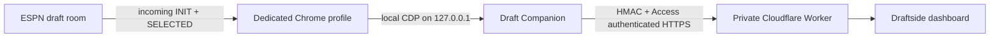

# Draftside Companion

> Draftside's tiny, read-only bridge between the ESPN draft room already open on your laptop and its private decision-support backend.

The companion keeps draft night to **one ESPN login and one draft-room session**. You draft normally in Chrome. This process observes only ESPN's incoming draft events through Chrome DevTools Protocol (CDP), normalizes the board, and sends signed updates to Cloudflare.

It does **not** require OpenClaw, automate selections, inspect cookies, retain or expose ESPN WebSocket endpoints, read outbound frames, or send commands to ESPN.



## What it handles

- Launches or attaches to a dedicated Chrome/Chromium profile.
- Arms read-only network observation before optionally reloading the draft tab.
- Streams `SELECTED` events with signed ESPN player IDs, including negative D/ST IDs.
- Treats `INIT` as the authoritative full-board recovery frame after a disconnect.
- Reconnects automatically without advancing its checkpoint until Cloudflare acknowledges the board.
- Writes owner-only (`0600`) checkpoint, health, and sanitized evidence files.
- Exposes simple `preflight`, `start`, `status`, `stop`, and foreground `run` commands.
- Loads secrets from the process environment or the operating system keyring—never from TOML.

## Requirements

- Python 3.11+
- Google Chrome or Chromium
- Windows 10/11, macOS, or Linux
- A generated Draftside initializer JSON
- Three workload credentials supplied by the operator:
  - `INGEST_HMAC_CURRENT`
  - `CF_ACCESS_CLIENT_ID`
  - `CF_ACCESS_CLIENT_SECRET`

The companion never needs your ESPN password or cookies. Sign in to ESPN yourself in its dedicated Chrome profile.

## Install

Clone the repository, open a terminal in `companion/`, then create an isolated environment.

### macOS / Linux

```bash
python3 -m venv .venv
source .venv/bin/activate
python -m pip install --upgrade pip
python -m pip install .
cp config.example.toml companion.toml
```

### Windows PowerShell

```powershell
py -3.11 -m venv .venv
.venv\Scripts\Activate.ps1
python -m pip install --upgrade pip
python -m pip install .
Copy-Item config.example.toml companion.toml
```

Edit `companion.toml` with the non-secret Worker URL, draft key, initializer path, and desired profile/state paths. The sample deliberately contains no credential fields.

## Credentials

### Option A: environment variables

Set all three variables only in the terminal used to start the companion. Avoid putting them in shell profiles, `.env` files, command arguments, or screenshots.

macOS/Linux:

```bash
export INGEST_HMAC_CURRENT='resolved-at-runtime'
export CF_ACCESS_CLIENT_ID='resolved-at-runtime'
export CF_ACCESS_CLIENT_SECRET='resolved-at-runtime'
```

Windows PowerShell:

```powershell
$env:INGEST_HMAC_CURRENT = 'resolved-at-runtime'
$env:CF_ACCESS_CLIENT_ID = 'resolved-at-runtime'
$env:CF_ACCESS_CLIENT_SECRET = 'resolved-at-runtime'
```

### Option B: OS keyring

Install the optional integration and set `runtime.credential_source = "keyring"` in `companion.toml`:

```bash
python -m pip install '.[keyring]'
```

Store values under the configured service (default: `draftside-companion`) with usernames matching the three environment-variable names. Use your OS credential manager or a small `getpass`-based setup script so values do not enter shell history. The CLI only reports whether credentials are available; it never prints them.

## Draft-night workflow

1. Run the preflight:

   ```bash
   draft-companion --config companion.toml preflight
   ```

2. If Chrome is not already running for this companion, `start` launches a dedicated profile. Sign in to ESPN in that window and open the draft room. A first launch may report that the tab is not ready; sign in, then rerun `start`.

   ```bash
   draft-companion --config companion.toml start
   ```

3. Check health at any time:

   ```bash
   draft-companion --config companion.toml status
   ```

   States are `starting`, `live`, `reconnecting`, `complete`, or `stopped`. Output contains paths and counters, never credentials or ESPN session material.

4. Stop cleanly:

   ```bash
   draft-companion --config companion.toml stop
   ```

For troubleshooting, run it in the foreground:

```bash
draft-companion --config companion.toml run
```

## Local files

The configured state directory contains:

- `health.json` — current state, process ID, pick count, reconnect count, and last commit duration.
- `checkpoint.json` — last board acknowledged by Cloudflare; used for restart recovery.
- `evidence.ndjson` — sanitized commit timing and recovery records.
- `companion.log` — detached-process output.
- `chrome-profile/` — the dedicated browser profile. Treat this directory as private browser data.

Do not publish, sync, or commit the state directory. The repository root `.gitignore` should exclude local configuration, state, profiles, checkpoints, evidence, and initializer artifacts before the repository is made public.

## Safety model

The browser boundary is intentionally narrow:

- CDP is explicitly bound to `127.0.0.1` and a dedicated profile.
- The observer enables Chrome's Network domain, identifies only the expected `fantasydraft.espn.com` socket in memory, and reads received payloads beginning with `INIT` or `SELECTED`. Socket URLs are never retained or logged.
- It does not call `Network.getCookies`, inspect request headers, retain debugger endpoints, subscribe to outgoing frames, or send ESPN application messages.
- `Page.reload` is the only optional browser action; it is used after observation is armed so the complete recovery frame cannot race startup.
- Every Cloudflare mutation is signed with a timestamped HMAC and a unique nonce, then separately authenticated through Cloudflare Access.
- Secret values stay in memory and are excluded from URLs, exceptions, health, evidence, and checkpoints.

The app is advisory infrastructure. The human manager remains the only actor who can select a player.

## Recovery behavior

| Failure | Behavior |
| --- | --- |
| Laptop network interruption | Health becomes `reconnecting`; the companion reattaches and waits for ESPN `INIT`. |
| Browser/tab reload | Full board is reconstructed from `INIT`, then replayed idempotently. |
| Cloudflare timeout | No local checkpoint advances; the same deterministic picks are retried. |
| Companion restart | Last acknowledged board loads from `checkpoint.json`; ESPN `INIT` reconciles current state. |
| Unknown/malformed frame | It is ignored or triggers a sanitized reconnect; no ESPN command is sent. |
| Conflicting draft order | Delivery stops and health reports a runtime error rather than silently corrupting the board. |

## Development

Tests use fake CDP sockets, fake Chrome launchers, fake credentials, and fake HTTP responses. They never connect to ESPN or Cloudflare.

```bash
python -m pip install -e '.[dev]'
pytest
```

The package intentionally depends only on `websocket-client` at runtime. Keyring support is optional.

## Portfolio notes

This directory is designed to stand on its own as a public engineering sample: small dependency surface, documented trust boundaries, deterministic HMAC contract, atomic state persistence, failure recovery, and platform-neutral operation. Before publishing the parent repository, remove or sanitize real league identifiers, generated initializers, evidence, screenshots, deployment names, and account-specific links elsewhere in the repository.

## License

MIT. See [LICENSE](LICENSE).
