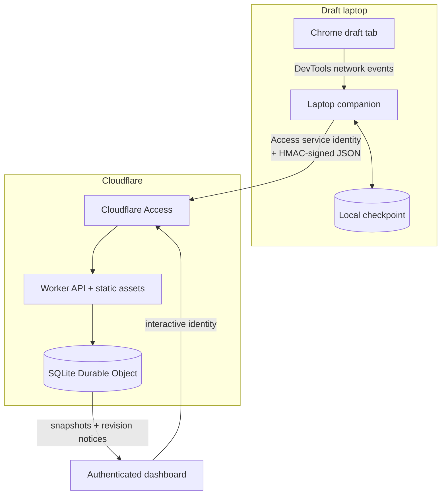
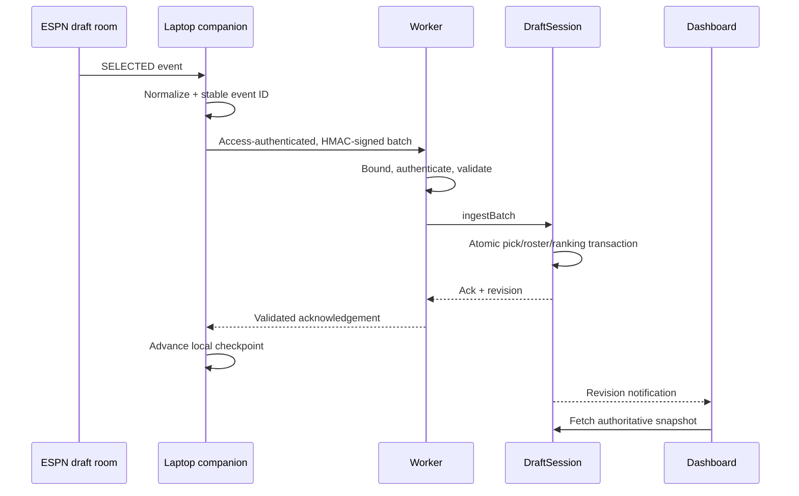

# Architecture

Draftside separates the authenticated browser session from the cloud decision system. The laptop handles only read-only observation and delivery; Cloudflare owns validated state, recommendations, and the dashboard.

## Design goals

1. **Never draft on the user's behalf.** The system observes and recommends; the user remains the only actor who selects players.
2. **Recover from interruption.** Reconnect state must reconstruct the board without guessing or silently skipping picks.
3. **Keep one source of truth.** Picks, rosters, availability, and recommendations change in one atomic state machine.
4. **Fail closed.** Advice stops when state is stale, gapped, conflicted, or unrecognized.
5. **Keep upstream credentials local.** ESPN authentication never enters the Worker, dashboard bundle, or repository.
6. **Stay reproducible.** A draft pins an immutable player catalog and uses a deterministic ranking engine.

## System topology

## Component responsibilities

### Laptop companion

The companion attaches to the selected ESPN draft-room tab through the local Chrome DevTools Protocol (CDP). It enables the DevTools Network domain and observes recognized draft messages received by that tab.

The prototype understands two draft-room message types:

- `SELECTED` provides the low-latency, pick-by-pick path.
- `INIT` contains the selected board and is authoritative after a browser reconnect.

It converts those observations into a versioned, provider-neutral pick schema. It persists an owner-only local checkpoint and advances it only after receiving a valid acknowledgement from the Worker. Lost acknowledgements are safe: retrying stable event IDs is idempotent.

The companion does not need or attempt to:

- inspect password fields;
- copy browser cookies into the cloud;
- reveal authenticated WebSocket URLs;
- send messages to ESPN's draft socket;
- click, queue, or select a player.

The repository contains both the original validated ingestion scripts and an installable CLI agent under `companion/`. The remaining one-click desktop packaging and laptop-specific acceptance work are described in [laptop-companion.md](laptop-companion.md).

### Cloudflare Worker

The Worker is the external trust boundary. It serves the static dashboard and exposes versioned routes for health, initialization, ingestion, snapshots, and WebSocket upgrades.

Before a mutation reaches draft state, the Worker:

1. enforces method and content-type rules;
2. reads a bounded request body;
3. validates timestamp, nonce, and HMAC signature against the exact body bytes;
4. validates the versioned JSON schema and path identity;
5. routes the request to the Durable Object named for that draft.

Security headers, generic error responses, and structured redacted logs are applied centrally. Mutable draft state is never held in Worker module globals.

### SQLite Durable Object

One `DraftSession` Durable Object is created per draft. Its SQLite storage owns:

- immutable draft configuration and pinned catalog version;
- normalized pick events and replay nonces;
- teams, rosters, and the remaining player pool;
- revision, liveness, missing-pick, duplicate, and conflict state;
- deterministic recommendations;
- connected dashboard sockets.

A batch is validated and committed as one state transition. Exact event replays succeed as duplicates. Reusing a pick number or event identity with different stable pick data is a conflict and does not overwrite the original state.

Signed ESPN player IDs are preserved. In particular, negative defense/special-teams IDs are valid; only the provider's explicit empty-slot sentinel represents “no selection.”

### Dashboard

The dashboard reads an authoritative snapshot and receives lightweight revision notices over a hibernating Durable Object WebSocket. A revision gap or reconnect triggers a fresh snapshot rather than client-side reconstruction.

Displayed state includes:

- best choices now, with concise reasons;
- available players, roles, tiers, and value;
- user and league rosters;
- experimental return-to-next-pick estimates;
- connection, ingestion, gap, and conflict health.

Recommendations are suppressed when the server considers source truth incomplete or stale.

## Event and recovery flow

### Normal selection

### Browser reconnect

After a tab reload or network interruption, the companion reads `INIT`, reconstructs every filled slot, and replays the normalized board. The Durable Object deduplicates picks it already owns and accepts missing picks in order. This same mechanism also recovers after local checkpoint loss.

### Failure policy

- **Duplicate event:** acknowledge without applying it twice.
- **Missing pick:** mark the gap and suppress recommendations until backfill closes it.
- **Conflicting pick:** reject the batch, retain original evidence, and stop guidance for review.
- **Stale/dead companion:** expose degraded health and suppress advice.
- **Dashboard socket loss:** reconnect and fetch a full snapshot.
- **Worker restart:** Durable Object SQLite remains authoritative.
- **Laptop sleep or network loss:** retain the last acknowledged checkpoint and reconcile from the next `INIT` state.

## Deterministic ranking

The ranking engine operates entirely on the pinned catalog and current draft state. Its inputs include projection and replacement value, tier, role and workload, injury and team environment, market cost, contingent upside, roster construction, and positional need.

Return-to-next-pick estimates use seeded, roster-aware simulations. Fixed inputs and seeds make the result repeatable. These values remain labeled experimental until evaluated against a suitable historical holdout set and calibration metrics.

The frozen-catalog boundary matters: a live draft never depends on a spreadsheet, news API, or mutable third-party ranking endpoint to answer the next-pick question.

## Security model

Draftside uses defense in depth:

- **Cloudflare Access** authenticates interactive viewers and gives the companion a scoped service identity.
- **Application HMAC** authenticates the exact ingestion body independently of Access.
- **Timestamp and nonce checks** limit replay; nonce claims and event writes share the same atomic Durable Object transaction.
- **Request bounds and schema validation** constrain CPU, storage, and malformed data before state mutation.
- **Secret separation** keeps browser authentication, Access identity, and HMAC material in different trust planes.
- **No alternate public route** prevents bypassing the Access-protected hostname.

Secrets belong in platform secret storage or the operating system credential store, never source, arguments, fixtures, URLs, logs, or dashboard assets.

## Why these Cloudflare primitives

The live draft needs strong per-draft coordination more than it needs a broad database stack. A Worker plus one SQLite Durable Object per draft supplies routing, transactions, persistence, and real-time fan-out with a small failure surface.

The project intentionally does not require D1, KV, R2, Queues, Workflows, or the Agents SDK for the current live path. They can be added when a concrete cross-draft or retention requirement justifies them, rather than duplicating the authoritative state.

## Validation boundary

The controlled end-to-end rehearsal used a disposable 64-pick draft. The live path carried 19 consecutive selections with a measured 739 ms frame-receipt-to-commit p95/max latency. A deliberate browser reload then recovered and committed the complete 64-pick board from reconnect state in 164 ms, with zero final gaps or conflicts.

Those measurements demonstrate the architecture under one controlled run. They are not a promise about ESPN availability, message formats, or latency. The provider transport is undocumented and may change, so a real deployment requires a pre-draft compatibility check and manual fallback plan.

## Public deployment boundary

A portfolio demo should use sanitized fixtures and `?mock=1`. A live deployment should remain private and must not publish league identifiers, draft keys, authenticated upstream payloads, catalog licensing-restricted data, checkpoints, or credentials.

This project is unofficial and uses no privileged ESPN integration. ESPN and related marks are trademarks of their respective owners.
