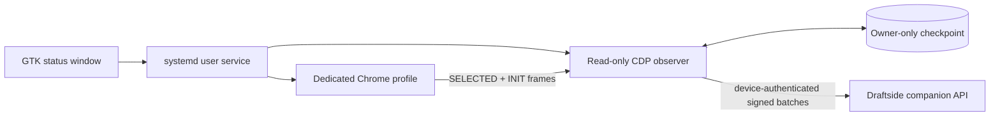

# Laptop Companion

The Laptop Companion runs beside the ESPN draft tab on the laptop being used to draft. This avoids depending on ESPN allowing two simultaneous manager sessions.

## User experience

1. Install the Ubuntu `.deb`.
2. Open **Draftside Companion**.
3. Enter the HTTPS address of the private Draftside dashboard.
4. Sign into ESPN in the dedicated Chrome window that Draftside opens.
5. Open the ESPN draft room in that window and wait for **Ready**.

Everything else is automatic. There are no pairing codes, API keys, TOML editing, or terminal windows. The private dashboard shows the registered laptop and can revoke or re-enable it.

The GTK window shows the private dashboard, dedicated Chrome, and ESPN draft-room connections independently. Redacted state transitions are also written to the systemd user journal for support diagnostics.

## Runtime design

The companion never enters ESPN credentials, reads password fields, exports cookies, sends draft-room socket messages, queues players, or submits picks.

## Automatic enrollment

On first launch the app asks the user for the deployment's HTTPS URL, stores it only in owner-only local configuration, and then:

- generates a random device UUID and token;
- stores both in Ubuntu Secret Service;
- registers the token verifier with the active private Draftside deployment;
- downloads only the active draft's minimal routing metadata;
- starts observation and delivery.

The backend stores only a SHA-256 verifier for the device token. Every batch is HMAC-signed with the device token, timestamped, and nonce-protected. Revocation immediately blocks registration and ingestion for that device until the authenticated dashboard explicitly re-enables it.

The dashboard remains behind Cloudflare Access. Only the bounded companion registration and ingestion endpoints are reachable by the app.

## Reliability

- **Browser reload:** recover the complete board from ESPN's `INIT` frame.
- **Network interruption:** retain the last acknowledged checkpoint and replay after reconnect.
- **Laptop restart:** reuse the same keyring identity and local checkpoint.
- **Duplicate event:** backend deduplication keeps the authoritative board exact.
- **Revocation:** stop delivery and show **Access revoked**.
- **Unexpected ESPN format:** fail closed and mark guidance stale.

## Ubuntu package

The Ubuntu 24.04 amd64 package includes:

- a GNOME application launcher with no terminal window;
- a GTK status application;
- a user-level systemd service;
- Secret Service credential storage;
- XDG-scoped configuration, Chrome profile, health, and checkpoint paths;
- reproducible Debian packaging and checksum validation.

The release package contains no deployment URL. The GTK onboarding screen asks for it before the background service starts.

Advanced diagnostics remain available through the CLI and `journalctl`, but they are not part of normal setup.

## Acceptance checklist

- [ ] Install and remove cleanly on the actual Ubuntu draft laptop.
- [ ] First launch enrolls automatically and appears on the dashboard.
- [ ] Revoke and re-enable from the dashboard.
- [ ] Complete a disposable live draft rehearsal.
- [ ] Reload Chrome and recover the exact board.
- [ ] Disable and restore Wi-Fi; verify replay and health transitions.
- [ ] Sleep and wake the laptop; verify stale detection and reconnect.
- [ ] Kill and restart the service; verify exact final state.
- [ ] Verify signed negative D/ST IDs.
- [ ] Inspect logs and artifacts for secrets.
- [ ] Rehearse manual board entry if ESPN changes its transport.

## Provider notice

The companion depends on an undocumented, read-only ESPN draft-room transport and may require maintenance when ESPN changes it. Draftside is unofficial and must not be used to circumvent provider authentication or access controls.
