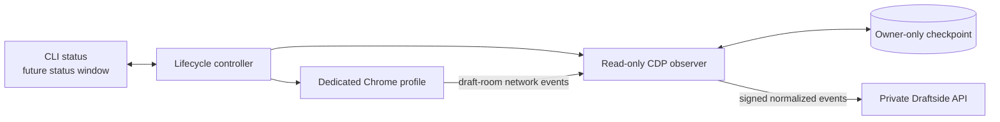

# Laptop Companion

The Laptop Companion is the local draft-night agent. It runs on the same laptop and observes the same ESPN draft tab the user is actively using.

That arrangement is intentional: one browser login, one draft-room session, and no dependence on whether ESPN tolerates simultaneous sessions for the same manager.

## Product boundary

The companion is not an auto-drafter and does not need a general-purpose AI runtime. It is a small, deterministic local service with one job:

> Observe the user's existing draft-room connection, normalize selections, and deliver them reliably to the private Draftside backend.

The repository includes an installable Python CLI package in `companion/` and a reproducible Ubuntu 24.04 amd64 Debian package. The `.deb` adds a GNOME launcher, user-level systemd supervision, XDG user paths, interactive Secret Service enrollment, checksums, and clean system-package removal while preserving private recovery data. Verification on the actual draft laptop and a short-lived server-side enrollment exchange remain release work.

## Intended experience

1. The user starts **Draftside Companion** from its GNOME launcher or CLI.
2. The companion performs a self-check: supported Chrome, backend reachability, clock agreement, initializer integrity, and credential availability.
3. It opens or attaches to a dedicated Chrome profile and guides the user to sign in directly on ESPN.
4. The user opens the ESPN draft room normally.
5. The companion attaches through local CDP before the draft socket opens, then shows **Connected**.
6. The desktop launcher opens the private dashboard in a separate tab after preflight succeeds.
7. The user drafts normally. The CLI exposes delivery health through its `status` command.
8. Closing the companion stops observation and removes runtime secrets from memory.

No ESPN password should ever be entered into the companion.

## Runtime design

### Core modules

- **Launcher:** starts the supported Chrome configuration, prevents duplicate instances, and shuts down cleanly.
- **Preflight:** verifies system clock agreement, backend health, browser availability, credentials, and initializer structure. Power-setting guidance and richer season/format checks belong in the packaged desktop release.
- **Observer:** attaches to the selected ESPN draft-room tab, filters recognized draft messages, and decodes live and reconnect state.
- **Reducer:** normalizes source events, validates draft order, preserves signed player IDs, and emits stable event identities.
- **Delivery worker:** signs bounded batches, retries safely, validates acknowledgements, and advances checkpoints only after acceptance.
- **Health surface:** the current CLI reports `starting`, `live`, `reconnecting`, `complete`, or `stopped`. A friendlier status window is planned for the packaged release.
- **Log scrubber:** records timing and lifecycle evidence without cookies, socket URLs, tokens, raw authenticated frames, or player/league identifiers in public diagnostics.

## Credential model

The companion needs backend credentials, not ESPN credentials.

- ESPN authentication remains inside Chrome's dedicated profile.
- A scoped Cloudflare Access service identity authorizes access to the private hostname.
- A separate HMAC key authenticates event bodies.
- Installed credentials should live in the operating system credential store (Keychain, Credential Manager, or Secret Service), scoped to the current user.
- Enrollment material should be revocable and rotatable without reinstalling the application.
- Secrets must never be written into config files, command-line arguments, checkpoints, logs, crash reports, or support bundles.

For a distributable build, prefer a short-lived enrollment exchange over shipping a long-lived shared secret in the installer.

## Reliability behavior

### Network interruption

The companion retains the last acknowledged cursor, reconnects with bounded backoff, and replays stable event IDs. It does not advance the checkpoint on an HTTP error, malformed response, or partial acknowledgement.

### Browser reload or crash

On reconnect, the draft room's initialization state supplies the filled board. The reducer replays it through the same delivery path, allowing the backend to deduplicate known picks and fill anything missed.

### Laptop sleep

The current companion's heartbeats make a sleeping or disconnected laptop become stale in the cloud, and the reconnect path waits for authoritative draft state before returning to `Live`. Explicit operating-system sleep/wake detection and a post-wake clock check remain packaging acceptance work.

The UI should advise the user to keep the laptop plugged in and awake during the draft; it should not silently modify system-wide power settings.

### Upstream format change

Unexpected frame shapes, team order, player identity, or pick sequence are hard failures. The companion stops ingestion, marks the dashboard stale, preserves sanitized diagnostics, and presents the manual fallback instead of guessing.

## Packaging target

The CLI package supports Chrome discovery on common desktop platforms, but the first polished desktop release should target the actual draft laptop operating system and architecture, then add other platforms only after testing.

The first package targets Ubuntu 24.04 LTS on amd64 and provides:

- distro-native Python dependencies with no Node.js or automation framework;
- GNOME launcher plus user-level systemd supervision;
- interactive owner-only routing/initializer installation and Secret Service storage;
- explicit setup, preflight, service, status, dashboard, and uninstall paths;
- reproducible build metadata and SHA-256 checksum;
- no auto-update channel until signing, rollback, and release provenance are established.

The packaged application should wrap the existing Python companion. Rewriting it solely to change languages would add risk without improving the read-only boundary.

## Acceptance checklist

Before using the companion in a real draft:

- [ ] Install and uninstall cleanly on the exact laptop.
- [ ] Sign in to ESPN only through Chrome; verify the companion never requests the password.
- [ ] Complete a disposable end-to-end draft rehearsal.
- [ ] Confirm live selections reach the board in under the agreed latency target.
- [ ] Reload Chrome mid-draft and recover the exact board.
- [ ] Disable and restore Wi-Fi; verify checkpoint replay and health transitions.
- [ ] Sleep and wake the laptop; verify stale detection and reconnect.
- [ ] Kill and restart the companion; verify exact-once final state.
- [ ] Verify D/ST selections with signed negative IDs.
- [ ] Confirm malformed, unknown, missing, and conflicting selections suppress advice.
- [ ] Inspect logs and support bundles for secrets and private identifiers.
- [ ] Confirm the dashboard remains inaccessible without the intended Access policy.
- [ ] Rehearse a manual board-update fallback independent of the companion.

## Remaining release questions

- Should the current interactive Secret Service enrollment be replaced by a short-lived single-use exchange?
- Should diagnostics stay entirely local, or may the user explicitly export a sanitized support bundle?
- What manual fallback should be available if ESPN changes its draft-room transport on draft day?

These choices affect packaging and support, but not the cloud state or ranking architecture.

## Provider notice

The companion depends on an undocumented, read-only browser transport and may need maintenance when ESPN changes its draft room. It must not be presented as an official integration or used to circumvent authentication or access controls.

This project is independent and unofficial. ESPN and related marks are trademarks of their respective owners.
